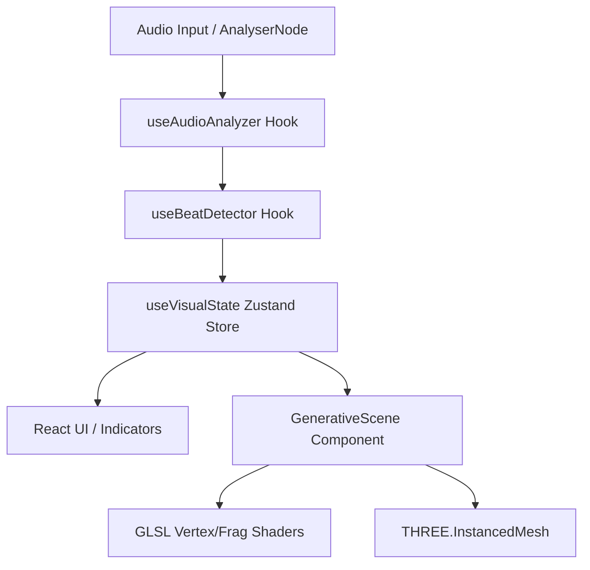

# System Architecture: Evolution Engine

## High-Level Data Flow

## Component Breakdown

- **`useAudioAnalyzer`**: Extracts raw frequency data (Bass, Mid, High, Energy) with multi-stage smoothing.
- **`useBeatDetector`**: Implements dynamic thresholding to detect kicks and tracks 16-beat phrases.
- **`useVisualState`**: The brain of the system. Manages `sceneIndex`, `beatCount`, and `activePalette`. Evolves state every 16 kicks.
- **`GenerativeScene`**: A single parametric component that morphs geometry and uniforms based on the store's state. Uses `maath/easing` for smooth transitions.
- **`VisualizerScene`**: Orchestrates environment (lights, fog, camera) and reactive lighting logic.

## Design Patterns

- **Parametric State Evolution**: Instead of switching components, a single component adapts its properties based on a continuous `evolution` float (0.0 to 1.0).
- **GPU-Heavy, CPU-Light**: Complex deformations are handled in GLSL; CPU only manages high-level state and matrix transfers.
- **Reactive Lighting**: Lights pulse through direct mutation within the `useFrame` loop for performance.
